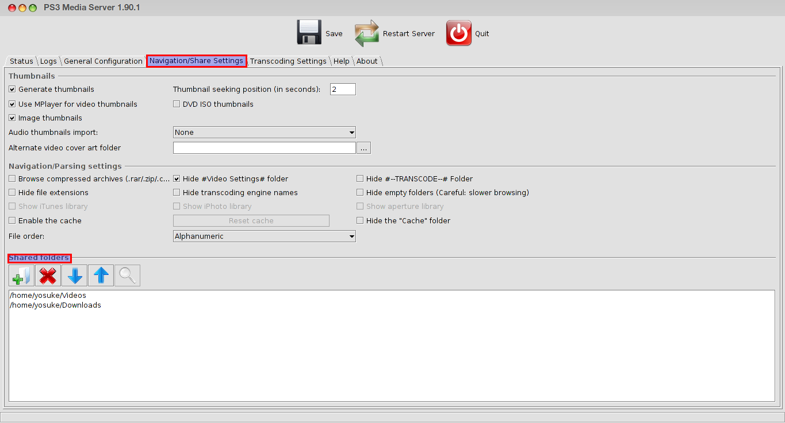

Title: Stream video from Linux
Slug: stream-video-from-linux
Author: Josue Kouka
Date: 2014-02-02
Tags: linux, media, video, streaming
Category: Linux
Summary: Stream medias from linux to wifi connected devices

Hey guys !!!

As always, the story of grandpa Joe. Like a lot of people, i like watching movies and documentaries. And i used to sleep in bed with my computer because
i was too tired to seat on the desk before sleeping. Having my laptop in my bed next to me wasn't that comfy.
So i decided to look for an app which will stream my movies and documentary
from my ***Pear OS*** (which doesn't exist anymore) to any devices connected
to the same network (Other computers, smartphones and tablets or consoles games).
I've tried [rygel](https://wiki.archlinux.org/index.php/Rygel). Butit wasn't working that well. I kept digging, and i finally found _*Ps3 Media Server*_, which has been a lifesaver.

How to install it ?

    :::console
    yosuke@loking:~$sudo aptitude install ps3mediaserver

The only thing which is required to set up is below:

Then all you need to do, is the install any ***UPNP*** client on the device on which you want to watch/listen your media. Most consoles games such as Ps3 and Xbox have already those kind of player pre-installed.

